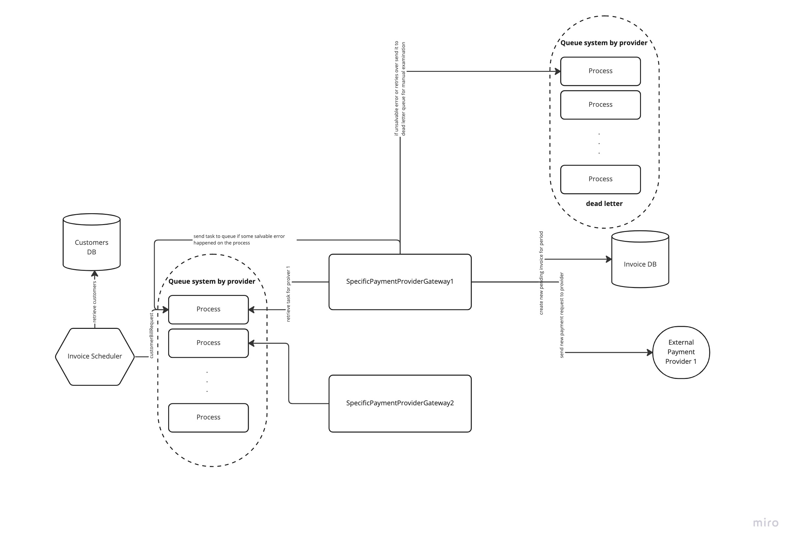
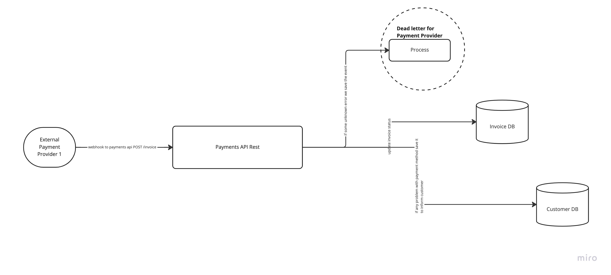
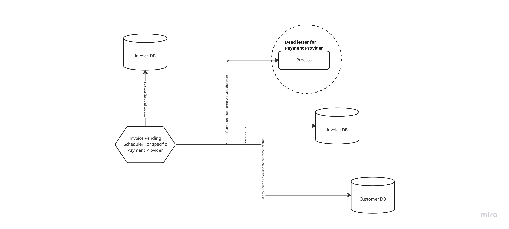

# Recurrent Invoice Payment Service

This projects holds the mandatory pieces to realize a basic recurrent invoice payment process 
that is realized at the start of each month.

## Ubiquitous Language

- Payment Provider: gateway between consumer and provider that allows multiple payment methods.
can be limited in some countries
  - have transactions fees
  - have change of currencies fees [Out of current problem]
  - have credit card fees
- Payment methods: ways to pay for a given resource, the most popular can be
  - card (Visa, MasterCard)
  - Digital Wallet
  - Paypal
  - Bank Transfer
- Invoice: A payment request
- Customer: Specific consumer using our services that pays a recurrent invoice

## Some Assumptions

We don't have to focus on the complexity of the Payment Provider, even when a real
payment provider usually has an asynchronous way to respond for example
webhooks, or you have to ask them recurrently the status of your transaction.

We will assume that the customer has already configured correctly a valid payment provider for his region,
and we have a provider key that relates this customer with the provider where all the
payment information is stored (if it was via credit card the number, expiration date, CVV...)

As in fact defined on the Payment Provider interface we would only allow transactions 
that has the same currency that found on the bank account, as realize currency conversion
it can be really difficult as the relation of currencies can change really fast

Our current system is a little one with few customers, so we can contain all the 
steps on a single process [TODO show here basic diagram]

For next iterations about how to scalate the current application on the next section 
we show some system design that could help evolve it.

In all our designs we will guess that we use the same transactional DB for both
Customers and Invoices so we can just delegate the consistency of our state to 
a transaction, in more complex system we probably would have different DBs so a distributed 
transaction will be in need and for it we should implement one of the next solutions:
- Two phase commit
- TC/C 
- Saga 

## Some annotations

- In a project done by me some of the decisions that I will have taken differently will be:
  - Use a more functional approach for errors that will help avoid nulls on the repository layer (Arrow for kotlin with Either)
  - Use a hexagonal approach

## System Design For a real and Scalable Solution

The first step composed by the job launched by a crontab will send the tasks to the queue system (for each provider a specific queue)
and then each worker will read from the specific queue to end up having a pending invoice and the invoice send to the specific payment 
provider.

If we receive at any stage an error that can be handled we send again the task to the queue with a lower retry, if we are not able to 
end up the transaction after all retries or because an unknown or unhandled error we send it to a dead letter tasks to be checked manually

This flow will be in case that the payment provider offers an async solution like webhooks

The next flow will be in case a payment provider had not an async method so its our processes who should ask if the transaction has end it

## Steps to realize
 - Fix minor errors to launch docker process in local
 - New Readme with the proposal and next steps
   - Diagrams of possible System Designs
 - Update versions of dependencies (languages & frameworks) to the following:
   - more updated documentation
   - performance improvements
   - security and bug fixes
 - [Optional] Set sonar coverage tool
 - Add unit tests to current architecture already developed
 - Develop the use case proposed in iterative steps :
   - Billing Service would handle the logic on a job that will be launched by a cron
     - Create docker file to launch Cron
     - Create simple job that reads all customers alive.
     - Update the job to create an invoiceRequestTask
     - Update the job to send the new invoiceRequestTask to a queue system
     - Create a process (worker) that read the task
     - Update the process to create a pending invoice
       - Customer currency
       - Amount to pay --> We will assume that the amount is static for each currency.
       - Invoice month (month/year)
       - Status --> Pending
     - Update the process to send to the queue again the invoiceRequestTask if an error adding the invoice
     - Send the invoice to the payment provider service
     - For expected true response we update the invoice status to PAID
       - if any error we send to a specific queue to deal with invoices 
         to be set as paid
     - If error on Payment Provider
        - if we can retry it (Network Exception) send to queue again with retry -1
        - if customer was not found update customer status to say bad configuration on payment provider
        - if currency not match update customer status with error to say to them that problem with currency

